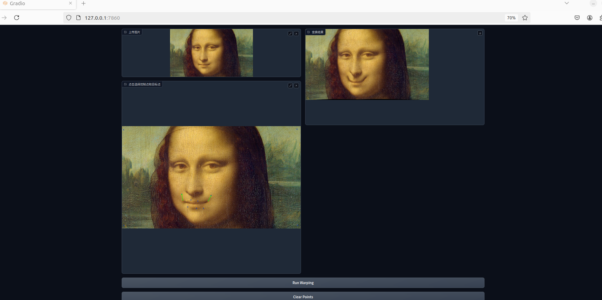
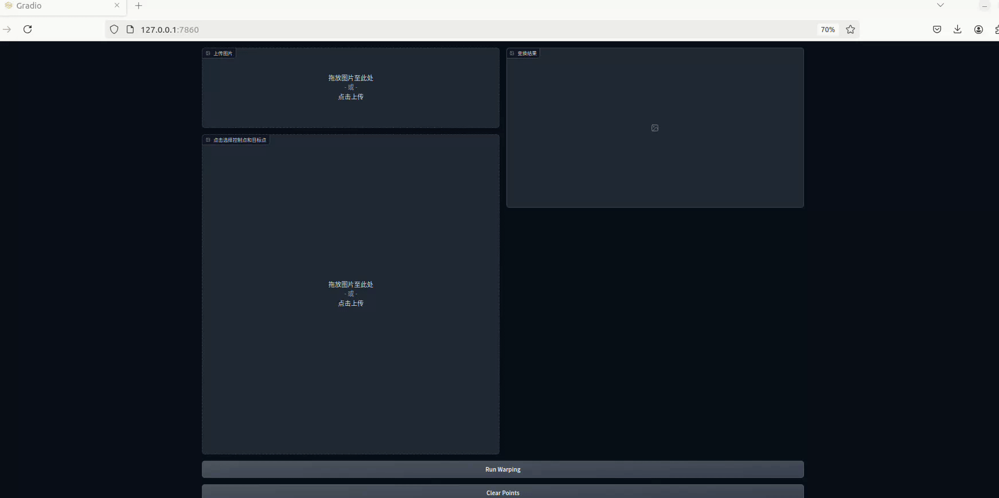

# Implementation of Image Geometric Transformation

This repository is Yulin Chen's implementation of Assignment_01 of DIP. 



## Requirements

To install requirements:

```setup
pip install -r requirements.txt
```

## Running

To run basic transformation, run:

```basic
python run_global_transform.py
```

To run point guided transformation, run:

```point
python run_point_transform.py
```

## Results

### Basic Transformation


### Point Guided Deformation

所实现的算法为基于MLS的刚性变换算法.

以下两张动图展示的是在 $100 \times 100$ 的网格上计算图像变换后插值得到的结果.

棋盘格图片所选择的控制点为固定图片的四个角, 并将下边缘向中心移动. 该图片的分辨率为 $256 \times 256$.


蒙娜丽莎图片选择的控制点为固定图片的四个角, 将嘴角向上移动并固定嘴唇边缘. 该图片的分辨率为 $512 \times 293$.


以下两张动图展示的是在 $300 \times 300$ 的网格上计算图像变换后插值得到的结果, 控制点的选择均与之前相同.




## Acknowledgement

>📋 Thanks for the algorithms proposed by [Image Deformation Using Moving Least Squares](https://people.engr.tamu.edu/schaefer/research/mls.pdf).
