# Assignment 2 - DIP with PyTorch

This repository is Yulin Chen's implementation of Assignment_02 of DIP.

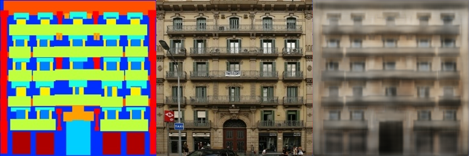

## Requirements

The install method is based on Conda package and environment management:

```bash
conda create -n dip_02 -y python=3.10
conda activate dip_02
pip install torch torchvision --index-url https://download.pytorch.org/whl/cu118
pip install -r requirements.txt
```

## Running

### Poisson Image Editing with PyTorch

To run Poisson Image Editing with PyTorch, run:

```bash
python run_blending_gradio.py
```

### Pix2Pix train/eval

- Change directory to Pix2Pix
```bash
cd Pix2Pix
```

- Download a pix2pix dataset (e.g., [facades](http://cmp.felk.cvut.cz/~tylecr1/facade/)):
```bash
bash download_dataset.sh facades
```

- Train the model
```bash
python train.py --dataset facades
```

- Evaluate the model
```bash
python eval.py --dataset facades --model <path to pre-trained model>
```

## Pre-trained Models

You can download pretrained models here:

- [Pix2Pix models](https://rec.ustc.edu.cn/share/d78bb2d0-960d-11ef-bc7d-098a7a25d4d3)

## Results

### Poisson Image Editing with PyTorch

以下三张图片展示的是使用PyTorch进行泊松图像编辑, 通过梯度下降优化10000次后的实验结果

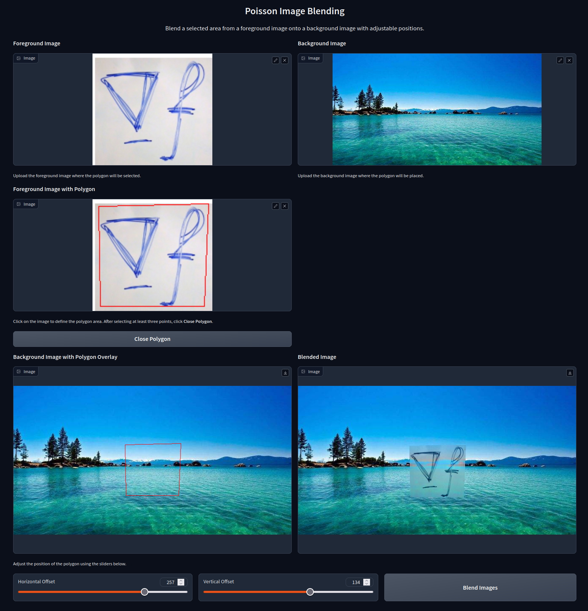

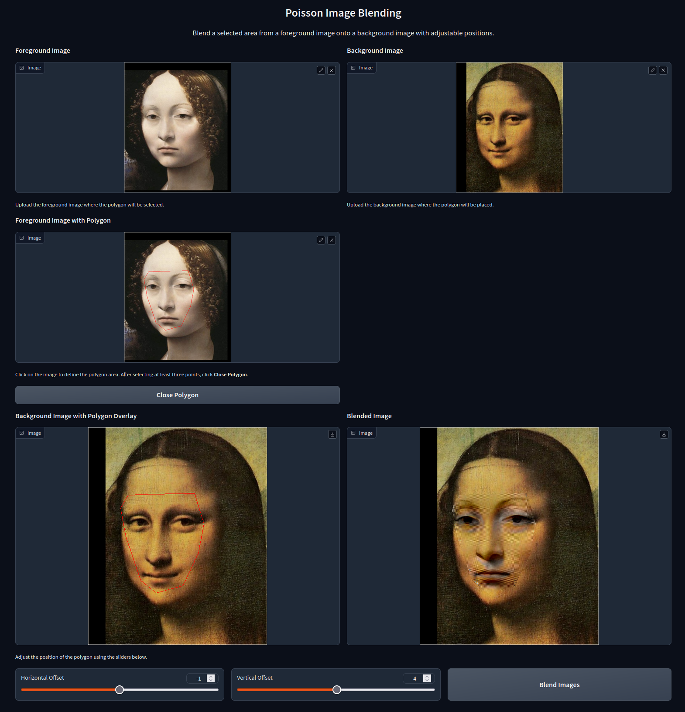

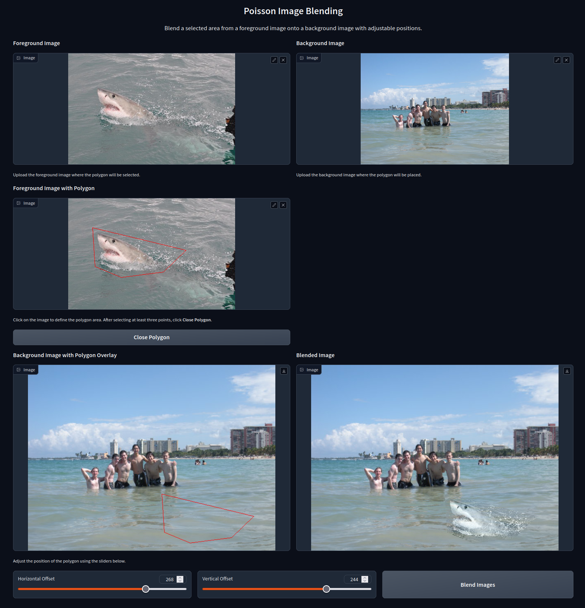

### Pix2Pix

实验中采用的网络为全卷积神经网络, 其整体结构与[Pix2Pix](https://phillipi.github.io/pix2pix/)中采用的U-Net结构类似, 其中skip connections的部分与[FCN](https://arxiv.org/abs/1411.4038)论文中的实现类似, 直接将下采样时卷积层的输出与上采样时对应的转置卷积层的输入相加. 实验分别选用了Facades数据集和Cityscapes数据集进行训练. 在实验过程中, 当epoch大于200后网络过拟合现象较为严重, 验证集上损失函数值增加, 故在两个数据集上的训练均在200个epoch后结束.

下列实验结果中最左侧的为输入的语义标签图像, 中间为真实结果, 右边为神经网络所输出的RGB图像.

以下是在Facades数据集上训练了200个epoch后, 训练集上的实验结果.

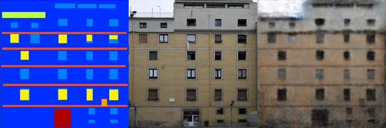

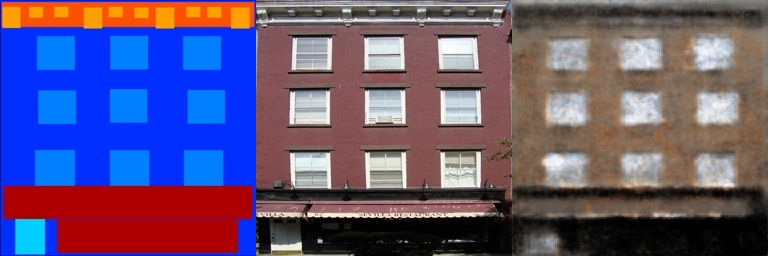

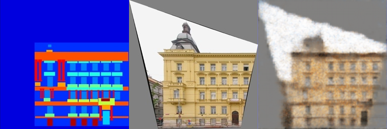

以下是在Facades数据集上训练了200个epoch后, 验证集上的实验结果.

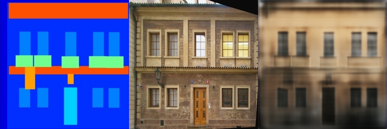

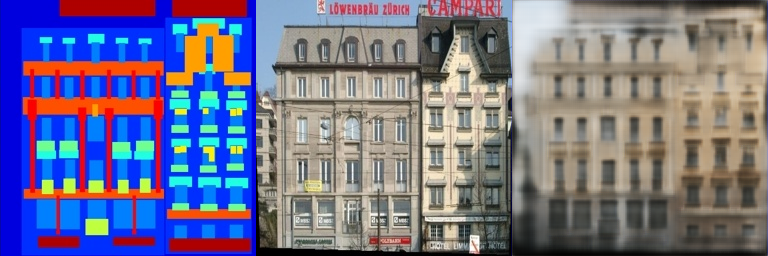


以下是在Cityscapes数据集上训练了200个epoch后, 训练集上的实验结果.

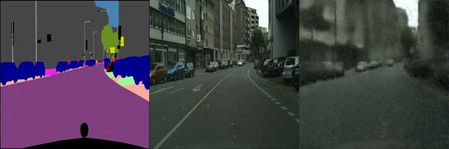

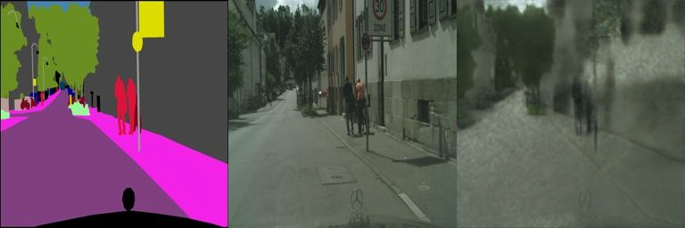

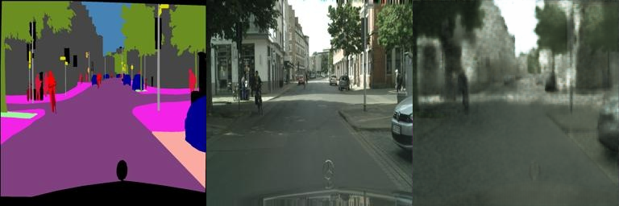

以下是在Cityscapes数据集上训练了200个epoch后, 验证集上的实验结果.

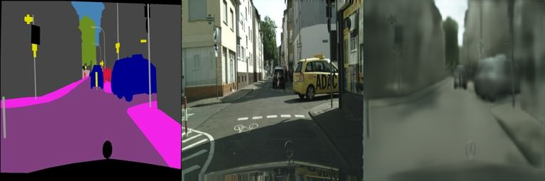

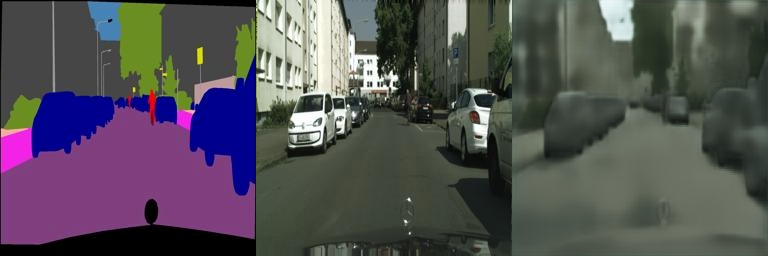

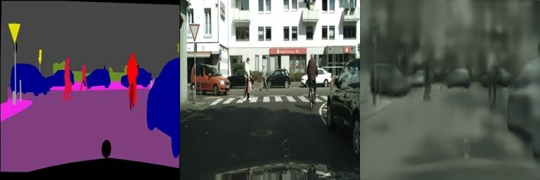

## Acknowledgement

>📋 Thanks for the algorithms proposed by
>
> [Paper: Poisson Image Editing](https://www.cs.jhu.edu/~misha/Fall07/Papers/Perez03.pdf)
>
> [Paper: Image-to-Image Translation with Conditional Adversarial Nets](https://phillipi.github.io/pix2pix/)
>
> [Paper: Fully Convolutional Networks for Semantic Segmentation](https://arxiv.org/abs/1411.4038)
