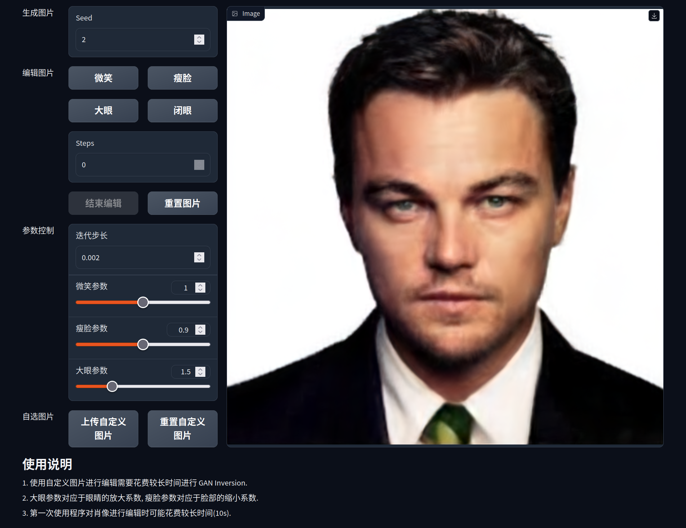

# Assignment 3 - Play with GANs

This repository is Yulin Chen's implementation of Assignment_03 Part 2 of DIP.



## Requirements

The install method is based on Conda package and environment management:

```bash
conda env create -f environment.yml
conda activate dip_03_part2
pip install -r requirements.txt
python scripts/download_model.py
```

## Running

To run automated portrait editor, run:

```bash
python main_gradio.py
```

## Results

以下四张动图分别展示的是自动肖像编辑器的微笑, 瘦脸, 大眼和闭眼功能.


自动肖像编辑器可以用于编辑用户的自定义图片.


## Acknowledgement

>📋 Thanks for the algorithms proposed by
>
> [Paper: Drag Your GAN: Interactive Point-based Manipulation on the Generative Image Manifold](https://vcai.mpi-inf.mpg.de/projects/DragGAN/)
>
>💻 Additionally, special thanks to the following repositories for providing valuable code:
>
> [Official DragGAN](https://github.com/XingangPan/DragGAN) and [DragGAN with PTI](https://github.com/tianhaoxie/DragGAN_PTI) for the implementation of [Drag Your GAN](https://vcai.mpi-inf.mpg.de/projects/DragGAN/).
>
> [face alignment](https://github.com/1adrianb/face-alignment) for the code related to facial landmarks detection.
