# Assignment 3 - Play with GANs

This repository is Yulin Chen's implementation of Assignment_03 Part 1 of DIP.

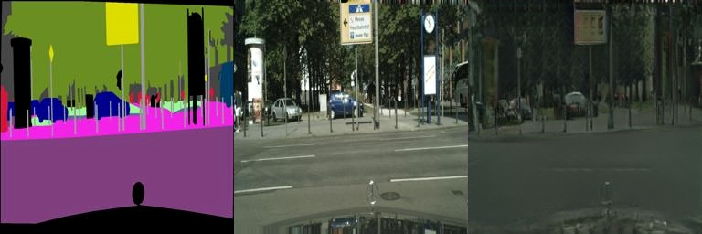

## Requirements

The install method is based on Conda package and environment management:

```bash
conda create -n dip_03_part1 -y python=3.10
conda activate dip_03_part1
pip install torch torchvision --index-url https://download.pytorch.org/whl/cu118
pip install -r requirements.txt
```

## Running

- Download a pix2pix dataset (e.g., [facades](http://cmp.felk.cvut.cz/~tylecr1/facade/)):
```bash
bash download_dataset.sh facades
```

- Train the model
```bash
python train.py --dataset facades --preprocess
```

- Evaluate the model
```bash
python eval.py --dataset facades \
 --net_G <path to pre-trained generator network> \
 --net_D <path to pre-trained discriminator network>
```

## Pre-trained Models

You can download pretrained models here:

- [Pix2Pix models](https://rec.ustc.edu.cn/share/d78bb2d0-960d-11ef-bc7d-098a7a25d4d3)

## Results

实验分别选用了Facades数据集和Cityscapes数据集进行训练, 在两个数据集上的训练均在200个epoch后结束.

下列实验结果中最左侧的为输入的语义标签图像, 中间为真实结果, 右边为神经网络所输出的RGB图像.

以下是在Facades数据集上训练了200个epoch后, 训练集上的实验结果.

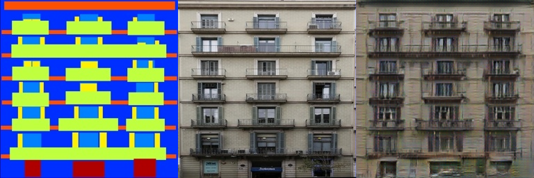

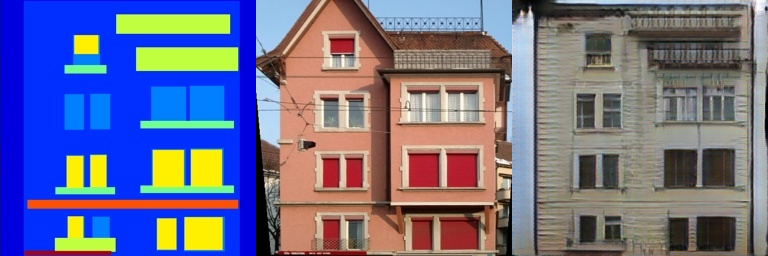

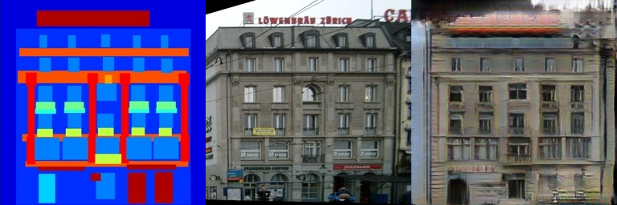

以下是在Facades数据集上训练了200个epoch后, 验证集上的实验结果.

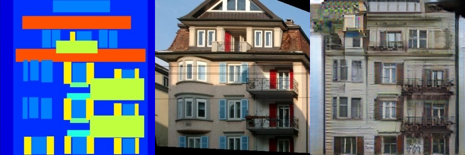

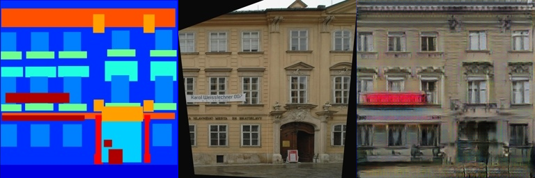

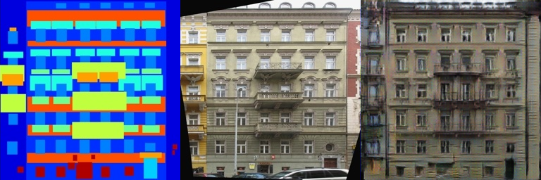

以下是在Cityscapes数据集上训练了200个epoch后, 训练集上的实验结果.

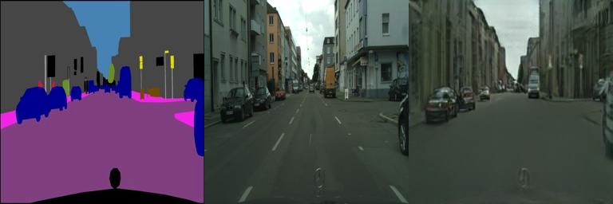

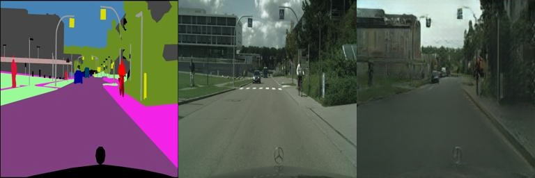

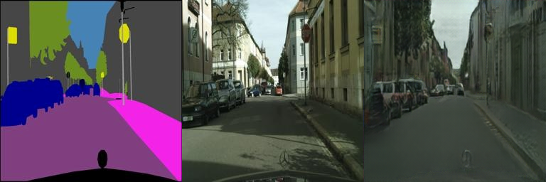

以下是在Cityscapes数据集上训练了200个epoch后, 验证集上的实验结果.


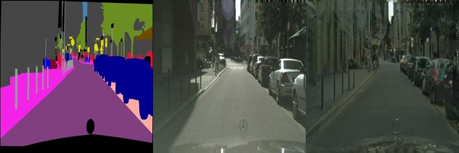

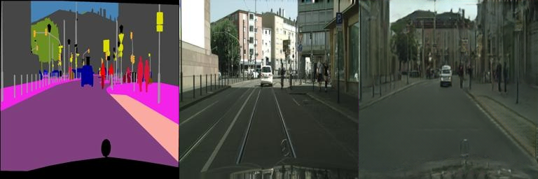

## Acknowledgement

>📋 Thanks for the algorithms proposed by
>
> [Paper: Image-to-Image Translation with Conditional Adversarial Nets](https://phillipi.github.io/pix2pix/)
