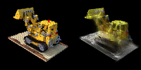

# Assignment 4 - Implement Simplified 3D Gaussian Splatting

This repository is Yulin Chen's implementation of Assignment_04 of DIP.



## Requirements

The install method is based on Conda package and environment management:

```bash
conda create -n dip_04 -y python=3.10
conda activate dip_04
conda install pytorch==2.0.1 torchvision==0.15.2 pytorch-cuda=11.8 -c pytorch -c nvidia
conda install https://anaconda.org/pytorch3d/pytorch3d/0.7.7/download/linux-64/pytorch3d-0.7.7-py310_cu118_pyt201.tar.bz2
pip install -r requirements.txt
```

## Running

To recover camera poses and a set of 3D points from multi-view images, run

```bash
python mvs_with_colmap.py --data_dir data/chair
```

To build 3DGS model, run:

```bash
python train.py --colmap_dir data/chair --checkpoint_dir data/chair/checkpoints
```

## Results

由于显存的限制, 实验中对从Colmap中得到的点云和输入的多视角图片进行了下采样, 具体来说, 对点云通过最远点采样得到了 $3000$ 个点, 对图片进行下采样使之分辨率为 $100 \times 100$. 以下分别是在chair和lego数据集上训练200个epoch后得到渲染结果与输入的多视角图片的比较, 其中左侧为输入的多视角图片, 右侧为训练后得到的3DGS模型的渲染结果.


以下是根据[3DGS Official Implementation](https://github.com/graphdeco-inria/gaussian-splatting)中的代码在同样的数据集上进行训练的结果. 官方代码对显存的要求较低, 在不需要对点云和图片进行下采样的情况下即可, 训练30000个epoch耗费的时间远小于PyTorch实现版本的训练时间, 达到了更好的渲染结果.


## Acknowledgement

>📋 Thanks for the algorithms proposed by
>
> [Paper: 3D Gaussian Splatting](https://repo-sam.inria.fr/fungraph/3d-gaussian-splatting/)
>
> [3DGS Official Implementation](https://github.com/graphdeco-inria/gaussian-splatting)
>
> [Colmap for Structure-from-Motion](https://colmap.github.io/index.html)
